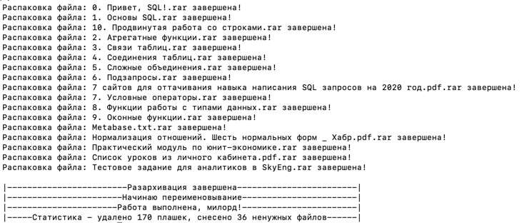

# Мини приложение для разархивирования файлов

чтобы запустить:

```git clone github.com/Basty64/go-unarchive```
```cd ./go-unarchive```
```docker build -t go-unarchive .```
Вставить вместо WAY-TO-YOUR-LOCAL-PATH свою папку с несколькими архивами на компьютере
```docker run -it --name unarchive -v /WAY-TO-YOUR-LOCAL-PATH:/go-unarchive/data go-unarchive:latest```
внутри самого контейнера:
```./data```


Скриншот работы:
